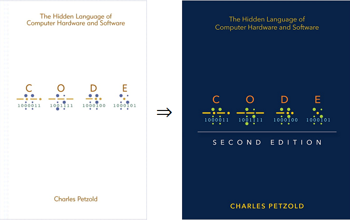

## 关于本项目

本项目包含了大名鼎鼎的著作 *Code: The Hidden Language of Computer Hardware and Software, 2nd Edition* 的一些参考资源（勘误表、书籍插图和PDF）和个人笔记。

本书讲述的是计算机工作原理。作者用丰富的想象和清晰的笔墨将看似繁杂的理论阐述得通俗易懂，你丝毫不会感到枯燥和生硬。更重要的是，你会因此而获得对计算机工作原理较深刻的理解。这种理解不是抽象层面上的，而是具有一定深度的。新版本编码更深入地探索了每个智能设备核心的逐位逐门构造：中央处理器，它结合了最基本的操作来执行最复杂的任务。关于第二版和第一版详细的区别，请访问作者的这篇[博客](https://www.charlespetzold.com/blog/2022/09/The-Changes-for-the-2nd-Edition-of-Code.html)获取更多信息。

除了大幅修订和更新的内容外，作者*Charles Petzold*还创建了一个[新网站](https://codehiddenlanguage.com/)，该网站使用动画交互图形使计算机更容易理解。另外，新版书籍标志性的封面仍然以盲文、摩尔斯电码和ASCII码的形式展示着“CODE”这几个字母。

另：若本项目对您有所帮助，请在页面右上角点个 Star ⭐ 支持一下，谢谢！

## 许可证

本仓库的所有资源（包括个人笔记）仅供学习交流使用，不可用于商业用途。若该仓库可能影响到了你的权益，可联系<a href="mailto:ascendho@outlook.com">本人</a>删除相关内容。
