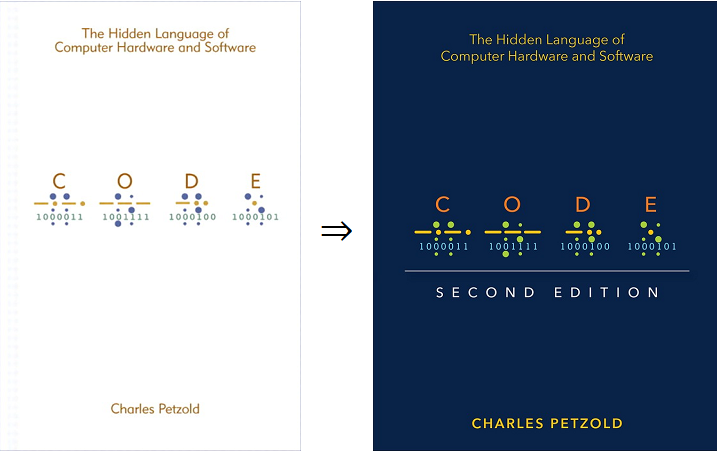

## code-2nd

本项目包含了大名鼎鼎的著作 *Code: The Hidden Language of Computer Hardware and Software, 2nd Edition* 的一些参考资源（勘误表，书籍插图、[交互式网站](https://codehiddenlanguage.com/)、英文版 PDF）和<a href="个人笔记">个人笔记</a>。

本书讲述的是计算机工作原理。作者用丰富的想象和清晰的笔墨将看似繁杂的理论阐述得通俗易懂，你丝毫不会感到枯燥和生硬。更重要的是，你会因此而获得对计算机工作原理较深刻的理解。这种理解不是抽象层面上的，而是具有一定深度的。新版本编码更深入地探索了每个智能设备核心的逐位逐门构造：中央处理器，它结合了最基本的操作来执行最复杂的任务。关于第二版和第一版详细的区别，请访问作者的这篇[博客](https://www.charlespetzold.com/blog/2022/09/The-Changes-for-the-2nd-Edition-of-Code.html)获取更多信息。

除了大幅修订和更新的内容外，作者 *Charles Petzold* 还创建了一个[交互式网站](https://codehiddenlanguage.com/)，该网站使用动画交互图形使计算机更容易理解。另外，新版书籍标志性的封面仍然以盲文、摩尔斯电码和 ASCII 码的形式展示着 "CODE" 这几个字母。

另：若本项目对您有所帮助，请在页面右上角点个 Star ⭐ 支持一下，谢谢！

## 勘误

如发现书中内容有误，可通过以下渠道反馈：

- **Microsoft Press 官方勘误页**：[https://www.microsoftpressstore.com/contact-us/errata](https://www.microsoftpressstore.com/contact-us/errata)
- **联系作者**：[cp@charlespetzold.com](mailto:cp@charlespetzold.com)

此外，本仓库的 [勘误表](勘误表) 目录中收录了官方勘误文档，可供参考。

> [!IMPORTANT]
>
> 本仓库所有资源（包括个人笔记）仅供个人学习交流使用，请勿用于任何商业用途。书籍及相关插图等内容的版权归原作者 *Charles Petzold* 与出版社所有，本仓库不持有任何版权。若本仓库内容影响到您的权益，请联系<a href="mailto:ascendho@outlook.com">本人</a>，将及时删除相关内容。
