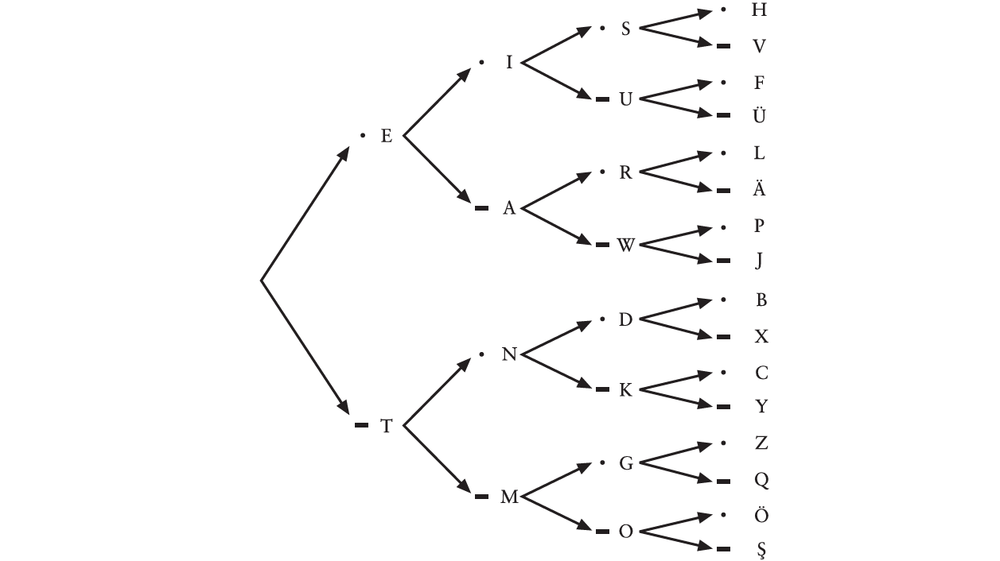
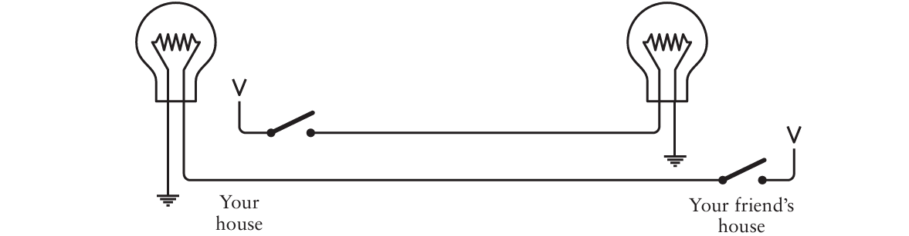
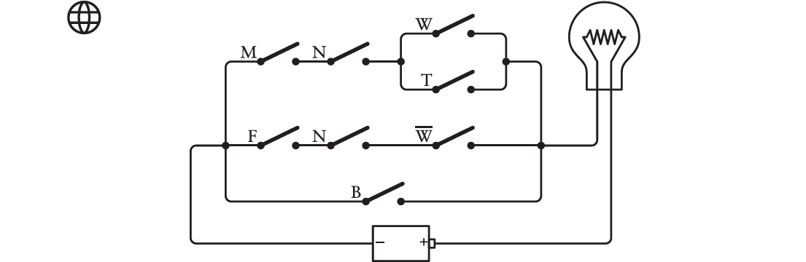

## 第一章——Best Friends

主要介绍了**莫尔斯电码**。当你在深夜想和对面的小伙伴交流信息的时候，虽然可以通过使用手电筒来模拟字迹传达信息，但是太过繁琐，也不精确。因此可以引入莫尔斯电码，它用点和划来表示每个字母，在手电筒上表示就是长闪和短闪，这种方式表达较为精确，也更简单、方便，但有一个缺点就是莫尔斯电码没有区分大写字母和小写字母。这一章节的一个核心思想是：**两个不同的事物，只要经过适当的组合，就可以表示所有类型的信息**。

## 第二章——Codes and Combinations

第一章提到的是编码的任务，这章介绍如何解码。假如你是对面的小伙伴，在收到朋友通过手电筒发出的消息后，解密出手电筒长闪和短闪背后的信息相对是比较困难的，因为译码者不得不根据一串由“点”、“划”组成的晦涩的编码序列来反查字母。但是我们只提供了“字母→莫尔斯码”的编码表，而缺少一张可以实现反向查询的“莫尔斯码→字母”译码表。因此我们可以构建像下面这样的树状图来帮助解码工作：

莫尔斯电码也被称作二进制码，因为这种编码的组成元素只有两个—— “点”和“划”。

## 第三章——Braille and Binary Codes

虽然莫尔斯电码对大多数人来说已足够使用，但是对于盲人这一特殊群体来说却无力使用这种编码系统。路易斯·布莱叶创造了**布莱叶盲文系统**，每个在书写文字中用到的符号——具体来说就是字母、数字和标点符号——都被编码成为2×3的点码单元中的一个或者多个凸起的点。该系统还引入了逃逸字符（用于区分大小写）和换档码（用于指示后面的内容是字母还是数字），但后面扩展的八点盲文系统使得小写字母、大写字母、数字和标点符号都可以拥有各自独特的代码，从而无需使用令人烦恼的换档和逃逸代码。

## 第四章——Anatomy of a Flashlight

本章首先简介了一下原子的内部构成（电子、质子、中子等）及其基本性质，然后解释了电灯泡的工作原理：在电路中，某原子所含有的一个电子逃逸到它相邻的下一个原子中，与此同时，这个原子又从相邻的上一个原子中获取一个电子，而失去电子的原子又会从与其相邻的一个原子获得电子，如此循环。电路中的电子不断地从一个原子移动到下一个原子，就形成了**电流**。另外还提到了导体、电阻和绝缘体的概念，并介绍了欧姆定律。

## 第五章——Communicating Around Corners

假如你的朋友不住在你的对面，而是住在你卧室的旁边，除非想办法摆一面镜子进行反射手电筒发出的光线，否则无法通过这种办法传递信息。但是利用前一章的知识，你可以构造下面这样的电路结构，通过打开或闭合开关，与你的朋友互相发送消息：

该电路利用地球来充当导体，以代替部分导线，节约了成本。要知道地球是一个巨大的导体，但是我们也可以把它看做是电子的来源和储藏库。当然地球还是有一定的电阻的，所以当我们使用1.5伏干电池和小灯泡时，不能通过接地来节约我们所需的线路开支。因为对于低电压电池而言，地球的电阻实在是太高了。 或者，如果你家的水管是用铜做的，并且是从屋外的地下接过来的，那么你可以在水管上接上导线。 

尽管当前这个通信系统只不过是个很简陋的装置，但是正是基于这个装置，**整个计算机系统才被构建出来**。

## 第六章——Logic with Switches

本章节引入了**布尔代数**，通过介绍布尔运算的一些基本性质及其与代数运算的一些区别，带领大家进入`true`或`false`的世界。接下来通过引入一个寻找符合特定特征的猫的例子来建立布尔表达式—— $(M × N × (W + T)) + (F × N × (1 − W)) + B$并运算，在此过程中还学习了如何建立真值表。紧接着介绍了电路的串并联方式，并构建电路来模拟该布尔表达式：

乔治·布尔从未连接过这样的电路，他也从未体验过目睹布尔表达式通过开关、电线和灯泡得以实现的激动时刻。

**注**：作者为本章制作了交互式例子，请点击[这里](https://codehiddenlanguage.com/Chapter06/)获取相关内容。

