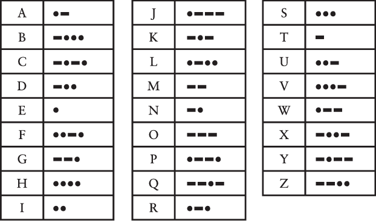
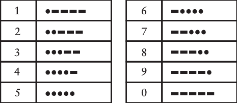
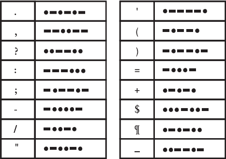

# 最好的朋友

​	您十岁那年，最要好的朋友住在街对面。你们卧室的窗户竟然正对着彼此。每晚父母照例在早得离谱的时辰宣布就寝后，那些亟待分享的思绪、见闻、秘密、八卦、笑话和梦境依然在暗夜里涌动。谁又能责怪孩子呢？交流的冲动，终究是人类最根本的特质之一。

​	当卧室灯光尚未熄灭时，你们还能隔着窗户挥手示意。通过夸张的肢体动作与基础肢体语言，尚能传递零星思绪。但当父母勒令「关灯！」后，任何复杂的信息交流都变得举步维艰——此时便需要动用更隐蔽的通讯方式。

​	该如何继续交流呢？若你足够幸运，十岁便拥有手机，或许可以偷偷通话或静音发短信。但倘若父母有睡前没收手机、甚至关闭Wi-Fi的习惯呢？一间失去电子通讯的卧室，无异于一座孤岛。

​	然而，你和好友确实拥有手电筒。众所周知，手电筒的发明本就是为了让孩子们躲在被窝里看书；而用它来进行夜间通讯似乎也再合适不过。手电筒足够安静，光束高度定向，大概不会从门缝渗出，惊动多疑的父母。

​	手电筒能开口说话吗？这绝对值得一试。一年级时你已学会在纸上书写字母和单词，将这项技能迁移到手电筒上似乎合情合理。只需站在窗前，用光线描绘字母即可。画O时，打开手电筒，在空中划个圈，然后关闭；写I时，只需画一道竖线。但你很快发现，这个方法糟糕透顶。看着朋友的手电筒在空中划出弧线与直线，你发现要在脑海中将这些笔画组合起来实在太难。这些光线的旋转与斜划根本不够精确。

​	或许你曾在某部电影里见过水手们用闪烁的灯光跨海传讯；另一部电影中，间谍晃动镜子，将阳光反射进关押同伙的房间。也许这就是解决之道。于是你们首先设计了一套简单方案：字母表中的每个字母对应一系列闪光。A闪1下，B闪2下，C闪3下，依此类推，直到Z闪26下。BAD这个词就是2下、1下、4下，字母间稍作停顿，以免将7下误认为G。单词间的停顿则更长些。

​	这方案似乎很有希望。好消息是不必再在空中挥舞手电筒，只需对准、点击即可。坏消息是，你们尝试发送的第一条消息（"How are you?"）总共需要131次闪光！更糟的是，你们忘了考虑标点符号，根本不知道问号该闪几下。

​	但你们已经很接近了。你确信一定有人遇到过这个问题——完全正确。去趟图书馆或上网搜索，你们就会发现一项奇妙的发明：摩尔斯电码。这正是你们梦寐以求的，尽管现在得重新学习如何"书写"所有字母。

​	区别在于：在你们自创的系统中，字母表中的每个字母都对应一定次数的闪光，从A闪1下到Z闪26下。而摩尔斯电码只有两种闪光——短闪和长闪。这当然使摩尔斯电码更复杂，但实际使用中却高效得多。现在，"How are you?"这句话只需32次闪光（有些短，有些长），而不是131次，而且包含了问号的编码。

​	讨论摩尔斯电码时，人们不说"短闪"和"长闪"，而是称之为"点"和"划"，因为这是印刷页面上展示编码的便捷方式。在摩尔斯电码中，字母表中的每个字母都对应一系列点和划，如下表所示。

​	尽管摩尔斯电码与计算机毫无关联，但熟悉编码的本质却是深入理解计算机硬件和软件中隐藏语言与内在结构的重要前提。

​	在本书中，"编码"一词通常指代在人与人之间、人与计算机之间或计算机内部传递信息的系统。

​	编码使交流成为可能。有时编码是秘密的，但大多数编码并非如此。事实上，大多数编码必须被广泛理解，因为它们是人际交流的基础。

​	我们用口腔发出的声音构成词语，形成一种编码，任何能听到我们声音并理解我们所说语言的人都能理解。我们称这种编码为"口语"或"言语"。

​	在聋人社区中，各种手语利用手和手臂形成动作和手势，传达单词的单个字母或整个单词和概念。北美最常见的两种系统是美国手语（ASL），它于19世纪初在美国聋人学校发展起来；以及魁北克手语（LSQ），它是法国手语的一个变体。

​	我们使用另一种编码来表示纸张或其他媒介上的文字，称为"书面语"或"文本"。文本可以手写或键入，然后印刷在报纸、杂志和书籍上，或以数字形式显示在各种设备上。在许多语言中，口语和书面语之间存在很强的对应关系。例如，在英语中，字母和字母组合（或多或少）对应于发音。

​	对于视力受损者，书面语可以用布莱叶盲文代替，它使用凸点系统对应字母、字母组合和整个单词。（我将在第3章更详细地讨论盲文。）

​	当需要快速将口语转录为文本时，速记法很有用。在法庭上或为电视新闻或体育节目生成实时字幕时，速记员使用速记机，其简化键盘包含自己的一套对应文本的编码。

​	我们使用各种不同的编码进行交流，因为某些编码比其他编码更方便。口语编码无法存储在纸上，因此使用书面编码代替。在黑暗中远距离无声交换信息无法通过言语或纸张实现。因此，摩尔斯电码是一种方便的替代方案。如果一种编码能实现其他编码无法实现的目的，它就是有用的。

​	正如我们将看到的，各种类型的编码也用于计算机中，以存储和传递文本、数字、声音、音乐、图片和电影，以及计算机内部的指令。计算机难以处理人类编码，因为它们无法精确复制人类使用眼睛、耳朵、嘴巴和手指的方式。教计算机说话很难，说服它们理解言语则更难。

​	但已经取得了很大进展。计算机现在能够捕获、存储、处理和呈现人类交流中使用的多种类型信息，包括视觉（文本和图片）、听觉（口语、声音和音乐）或两者的结合（动画和电影）。所有这些类型的信息都需要自己的编码。

​	甚至你刚才看到的摩尔斯电码表本身也是一种编码。该表显示每个字母由一系列点和划表示。但我们实际上无法发送点和划。用手电筒发送摩尔斯电码时，点和划对应于闪光。

​	用手电筒发送摩尔斯电码需要快速开关手电筒表示点，稍长时间表示划。例如，发送A时，快速开关手电筒，然后稍慢开关，接着在下个字符前暂停。按照惯例，划的长度应约为点的三倍。接收者看到短闪和长闪，就知道是A。

​	摩尔斯电码中点和划之间的暂停至关重要。例如，发送A时，手电筒在点和划之间应关闭约一个点的时间。同一单词中的字母之间用更长的暂停分隔，约一个划的长度。例如，这是"hello"的摩尔斯电码，展示了字母间的暂停：

	

单词之间用大约两个划长度的停顿分隔。以下是"hi there"的编码：

​	手电筒开关的持续时间并非固定不变。它们都是相对于一个点的长度而言的，这取决于手电筒开关的触发速度，以及发报者记忆特定字母编码的速度。一位快速发报者的划可能与一位慢速发报者的点长度相同。这个小问题可能会使解读摩尔斯电码信息变得困难，但在接收一两个字母后，接收者通常就能分辨出什么是点，什么是划。

​	起初，摩尔斯电码的定义——这里指的是点和划的各种序列与字母表中字母的对应关系——看起来就像电脑键盘布局一样随机。然而仔细观察后会发现，事实并非完全如此。更简单、更短的编码被分配给了更常用的字母，如E和T。拼字游戏玩家和《命运之轮》的粉丝可能会立刻注意到这一点。较不常见的字母，如Q和Z（在拼字游戏中值10分，而在《命运之轮》谜题中很少出现），则有更长的编码。

​	几乎每个人都知道一点摩尔斯电码。三个点、三个划、三个点代表SOS，这是国际求救信号。SOS并不是任何词语的缩写——它只是一个易于记忆的摩尔斯电码序列。第二次世界大战期间，英国广播公司在一些广播节目开头播放贝多芬第五交响曲的开头——BAH, BAH, BAH, BAHMMMMM——贝多芬在创作这首曲子时并不知道，有一天这会成为代表胜利（Victory）的字母V的摩尔斯电码。

​	摩尔斯电码的一个缺点是它不区分大小写字母。但除了表示字母外，摩尔斯电码还包含数字的编码，使用五个点和划的组合：

​	至少这些数字编码比字母编码更有规律一些。

​	大多数标点符号使用五、六或七个点和划的组合：

​	还有一些编码是为某些欧洲语言中的带重音符号字母定义的，以及用于特殊目的的速记序列。SOS代码就是这样一个速记序列：它应该连续发送，三个字母之间只有一个点的停顿。

​	你会发现，如果你有一个专门用于此目的的手电筒，你和朋友发送摩尔斯电码会容易得多。除了正常的开关滑块外，这些手电筒还包括一个按钮开关，你只需按下并松开即可开关手电筒。经过一些练习，你可能会达到每分钟发送和接收5到10个单词的速度——仍然比说话慢得多（大约每分钟100个单词），但肯定足够了。

​	当你和最好的朋友最终记住摩尔斯电码时（因为这是熟练发送和接收它的唯一方法），你也可以用声音代替正常说话来使用它。为了达到最大速度，你将点发音为dih（或当字母的最后一个点时发音为dit），将划发音为dah，例如V的dih-dih-dih-dah。就像摩尔斯电码将书面语言简化为点和划一样，代码的口语版本将语音简化为仅两个元音。

​	这里的关键词是二。两种类型的闪光，两个元音。实际上，两种不同的任何东西，都可以通过适当的组合传达所有类型的信息。

